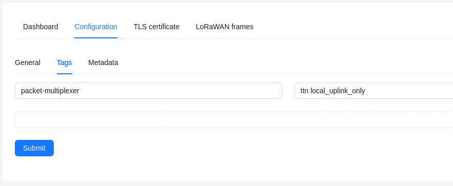

# ChirpStack Packet Multiplexer Configuration Helper

This script generates a `chirpstack-packet-multiplexer` configuration file based on tags in the gateways defined in the server.

## Usage

Recommended usage is via virtualenv. A convenient Makefile is included to easily create and run the scripts inside a virtual python environment. If you prefer you can also do it manually:

```
pip install virtualenv
virtualenv .venv
source .venv/bin/activate
pip install -Ur requirements.txt
deactivate
```

The lines above will create the environment and install the required packages. Then, to run the scripts you will have to:

```
source .venv/bin/activate
python multiplexer.py
deactivate
```

Steps to export devices from a TTS application into a ChirpStack application.

1) Copy the `config.example.yml` file into `config.yml` and edit it to match your requirements.
1) Run the script and provide missing information. The script will generate a YML in the specified location or in the local folder by default.

## Tags

The script connects to the Chirstack instance (it will need the URL, port and API TOKEN) looking for the `packet-multiplexer` tag in all the gateways.



Tag values can be separated by spaces or commas. The different values will the be matched against your `backends` as defined in the `config.yml` file. Gateways with a matching backend name will be added to that. A gateway can be added to one or more backends. Please be wise when allowing downlinks (`uplink_only: False`), specially if you have the same devices defined in more than one backend.